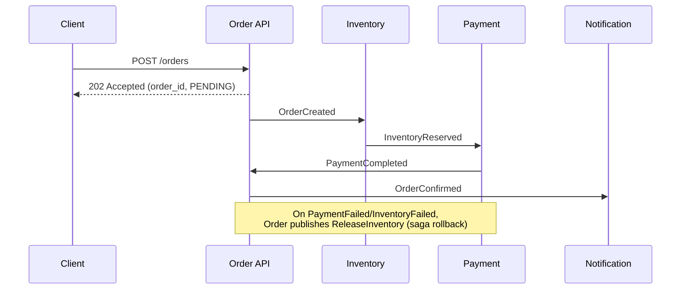

# Architecture

## Service flow (happy path + compensation)

## Topics
order.created, inventory.reserved, inventory.failed, payment.completed, payment.failed,
order.confirmed, order.failed, inventory.release, dlq

## Design notes to write up in the README
- Saga (choreography) vs two-phase commit, and why saga here.
- At-least-once delivery + idempotency (dedupe by event_id).
- Retry with backoff + dead-letter queue for poison messages.
- Partitioning by order_id for per-order ordering.
